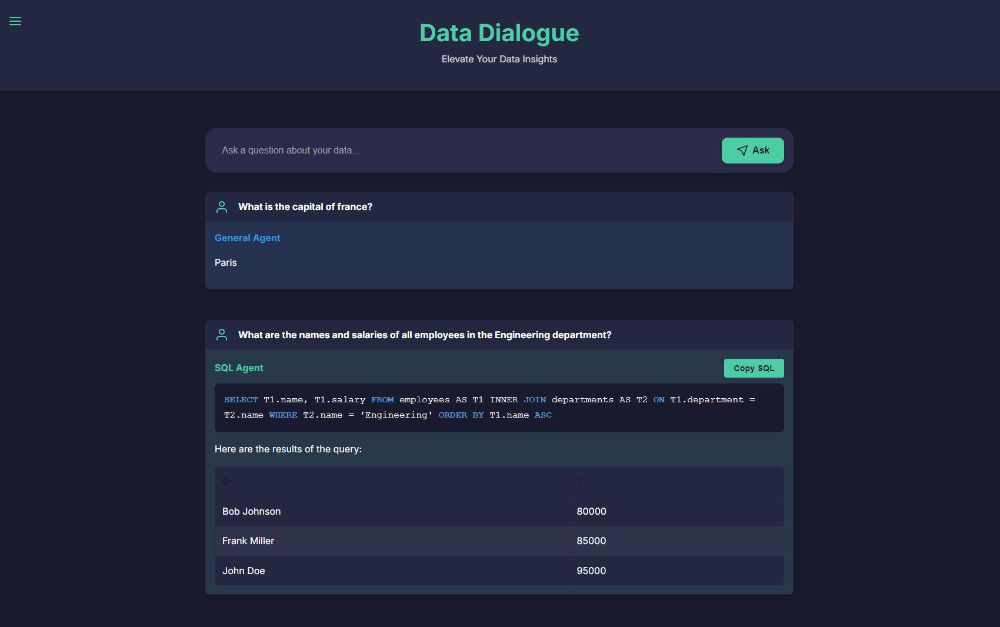

[](https://opensource.org/licenses/MIT)
[](https://github.com/ggeop/DataDialogueLLM/actions/workflows/release.yml)

# Data Dialogue
[](https://hub.docker.com/u/datadialogue)
[]()


      🎉 Welcome to the Data Dialogue Preview! 🚀

      We're excited to have you here! 🌟 Data Dialogue is currently in its preview phase, 
      which means you're getting an early look at our innovative AI-powered data interaction tool.

      💡 Your feedback is golden! If you spot anything unusual or have ideas for improvement, 
         please don't hesitate to let us know. Together, we're building something amazing!


Data Dialogue is an advanced application that leverages AI to create prompts, retrieve data from various sources, and generate responses using an LLM backend. It's designed to run in Docker and consists of two main services: the LLM backend and the UI.


## Features



- Natural language querying of databases
- Integration with multiple language models
- Flexible architecture for extending to different data sources
- RESTful API for easy integration
- Secure query execution with protection against harmful SQL commands

## Table of Contents

- [Installation](#installation)
- [Usage](#usage)
- [Project Structure](#project-structure)
- [Development](#development)
- [Contributing](#contributing)
- [License](#license)

## Installation

### Prerequisites

- Docker
- Docker Compose

### Quick Start

1. Clone the repository:
   ```sh
   git clone https://github.com/ggeop/data-dialogue.git
   cd data-dialogue
   ```

2. Run Data Dialogue services:

   **Linux**
   ```sh
   docker-compose --profile production pull && docker-compose --profile production up
   ```

   **Windows**
   ```powershell
   docker-compose --profile production pull; if ($?) { docker-compose --profile production up}
   ```

## Usage

After starting the services:

1. Access the frontend at `http://localhost:5000` in your web browser.
2. Start interacting with the system using natural language queries.
3. View the generated SQL and results from your queries.

## Project Structure

```
data-dialogue/
├── backend/
│   ├── app/
│   │   ├── api/
│   │   ├── core/
│   │   ├── services/
│   │   └── main.py
│   ├── Dockerfile
│   └── requirements.txt
├── frontend/
│   ├── static/
│   │   ├── css/
│   │   ├── images/
│   │   ├── js/
│   │   └── templates/
│   ├── app.py
│   └── Dockerfile
├── docker-compose.yml
├── .gitignore
├── .env.example
└── README.md
```

## Development

### Building the Backend

TODO: Add instructions for building and running the backend locally.

### Building the Frontend

TODO: Add instructions for building and running the frontend locally.

### Building with Docker Compose

For local development with volume mounting:

```sh
docker-compose up try-demo-db-local backend-local frontend-local --build
```

This will start:
- try-demo-db
- backend-local
- frontend-local

The frontend will be available at `http://localhost:3000`, and the backend at `http://localhost:8000`.

## Contributing

👉 [Contributing Guidelines](./CONTRIBUTING.md)

## License

Distributed under the MIT License. See [LICENSE](./LICENSE) for more information.
