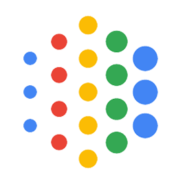
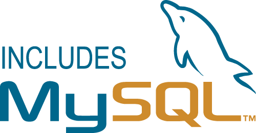

<div align="center">

<span style="font-size: 2em; font-weight: bold;">Data Dialogue</span>
<br>
<span style="font-size: 1.2em; font-style: italic;">Elevate Your Data Insights</span>
<hr>

[](https://hub.docker.com/u/datadialogue)
[]()
[](https://github.com/ggeop/DataDialogueLLM/releases/latest)


[](https://github.com/ggeop/DataDialogueLLM/actions/workflows/release.yml)
[](https://github.com/ggeop/DataDialogueLLM/actions/workflows/black.yml)
[](https://pydantic.dev)
[](https://opensource.org/licenses/MIT)

</div>

## 🎉 Welcome to Data Dialogue

<div align="center">
  <table>
    <tr>
      <td align="center">
        <a href="https://www.youtube.com/watch?v=breOr5o7r3Y">
          <picture>
            
          </picture>
          <br/>
        </a>
      </td>
    </tr>
    <tr>
      <td align="center">
        <a href="https://www.youtube.com/watch?v=breOr5o7r3Y" style="text-decoration: none;">
          <picture>
            
          </picture>
          <sup>Click to watch the demo video</sup>
        </a>
      </td>
    </tr>
  </table>
</div>

> Transform the way you interact with data using AI-powered conversations

DataDialogue is an innovative application that bridges the gap between your data and natural language understanding. By leveraging advanced AI capabilities, it enables intuitive data exploration and analysis through conversational interfaces.

A user can select a LLM model and connect it with a data source and do his analysis by writing simple prompts instead of writing SQL queries or code.


We're currently in an exciting preview phase! Here's what that means for you:

- 💡 **Early Access**: Get a first look at cutting-edge AI-data interaction
- 🔄 **Regular Updates**: Frequent improvements and new features
- 👥 **Community Driven**: Your feedback shapes the future of DataDialogue
- 🐞 **Bug Reports Welcome**: Help us polish the experience


Please don't hesitate to open an issue or submit a pull request.


## ✨ Key Features

- Natural language querying of databases
- Integration with multiple language models
   - Integration with HuggingFace models
   - Integration with Commercial models (currently with Google LLMs)
- Flexible architecture for extending to different data sources
- RESTful API for easy integration
- Secure query execution with protection against harmful SQL commands
- Create validated Queries (+ Copy option)
- Results Visualization
- **Supported Models**: Choose between HuggingFace & public providers
- **Data Sources**: Suppoorts connection with multiple data sources
 
<table>
<tr>
<td valign="top">
<h3>Supported Providers</h3>
<table>
<tr><th></th><th>Provider</th><th align="center">Status</th></tr>
<tr><td></td><td>Google</td><td align="center">✔️</td></tr>
<tr><td></td><td>HF</td><td align="center">✔️</td></tr>
<tr><td></td><td>OpenAI</td><td align="center">✔️</td></tr>
<tr><td></td><td>Anthropic</td><td align="center">✔️</td></tr>
</table>
</td>
<td width="40"></td>
<td valign="top">
<h3>Supported Data Sources</h3>
<table>
<tr><th></th><th>Source</th><th align="center">Status</th></tr>
<tr><td></td><td>PostgreSQL</td><td align="center">✔️</td></tr>
<tr><td></td><td>MySQL</td><td align="center">✔️</td></tr>
<tr><td></td><td>Databricks</td><td align="center">✔️</td></tr>
<tr><td></td><td>Mongo DB</td><td align="center">✔️</td></tr>
<tr><td></td><td>CSV</td><td align="center">✔️</td></tr>
</table>
</td>
</tr>
</table>

## 🎯 Getting Started


### Prerequisites

- Docker
- Docker Compose

### Run

1. Clone the repository:
   ```sh
   git clone https://github.com/ggeop/data-dialogue.git
   cd data-dialogue
   ```

2. Run Data Dialogue services:
   ```
   docker-compose --env-file .env.prod up
   ```


3. Access the frontend at `http://localhost:5000` in your web browser.

4. **Try the Demo**: Click the video above to see it in action
5. **Choose Your Model**:
   - Local: HuggingFace models (requires sufficient computing power)
   - Cloud: Commercial LLMs (recommended for lighter setups)

> **Pro Tip**: Get your [FREE Google Gemini API key](https://aistudio.google.com/app/apikey) for the best cloud-based experience!


## 📑 Development

For local development and setup instructions, please refer to our [Local Development Setup Guide](./docs/DEV_SETUP.md).

The guide includes:
- Local environment setup for Windows and Linux
- Code style configuration with Black
- Development workflows
- Common issues and troubleshooting
- Contributing guidelines


## 🤝 Contributing

Your feedback and contributions make DataDialogue better! If you have:
- 💭 Feature suggestions
- 🐞 Bug reports
- 💡 General feedback

Please read our [Contributing Guidelines](./docs/CONTRIBUTING.md) before submitting any pull requests.

## ♥️ Support and Community

- Report issues via [GitHub Issues](https://github.com/ggeop/DataDialogueLLM/issues)
- Join our community discussions [here](https://github.com/ggeop/DataDialogueLLM/discussions)

## ✋ Need Help?

Feel free to:
- Open an issue on GitHub
- Ask questions in pull requests
- Contact project maintainers

## 📎 License

Distributed under the MIT License. See [LICENSE](./LICENSE) for more information.
