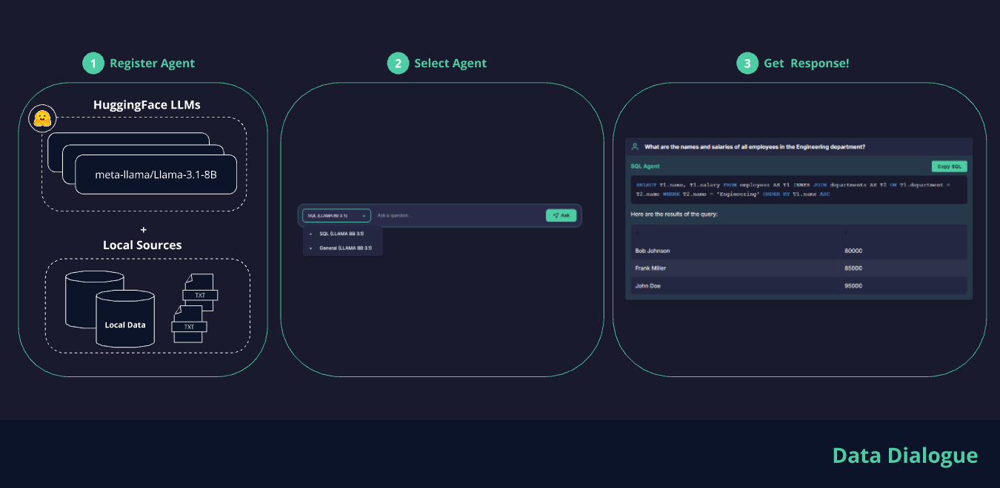
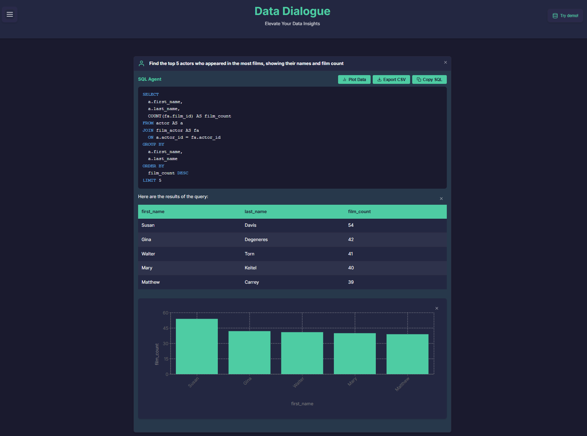

[](https://opensource.org/licenses/MIT)
[](https://github.com/ggeop/DataDialogueLLM/actions/workflows/release.yml)

# Data Dialogue
[](https://hub.docker.com/u/datadialogue)
[]()


      🎉 Welcome to the Data Dialogue Preview! 🚀

      We're excited to have you here! 🌟 Data Dialogue is currently in its preview phase, 
      which means you're getting an early look at our innovative AI-powered data interaction tool.

      💡 Your feedback is golden! If you spot anything unusual or have ideas for improvement, 
         please don't hesitate to let us know. Together, we're building something amazing!


Data Dialogue is an advanced application that leverages AI to create prompts, retrieve data from various sources, and generate responses using an LLM backend. It's designed to run in Docker and consists of two main services: the LLM backend and the UI.



### Demo 👇

Try our demo by clicking the "Try Demo" button. The demo mode loads an open-source DVD database (PostgreSQL) for testing and experimentation. We provide several example prompts to get you started, but you're welcome to create your own custom prompts.
The system supports both open-source language models from HuggingFace and commercial LLMs (such as Google Gemini).


   Google Gemini provides a FREE API [get key](https://aistudio.google.com/app/apikey).
   If your machine doesn't have enough processing power to run local HuggingFace models effectively, commercial LLMs are a great alternative.


[](https://www.youtube.com/watch?v=breOr5o7r3Y)

## Features
- Natural language querying of databases
- Integration with multiple language models
   - Integration with HuggingFace models
   - Integration with Commercial models (currently with Google LLMs)
- Flexible architecture for extending to different data sources
- RESTful API for easy integration
- Secure query execution with protection against harmful SQL commands
- Create validated Queries (+ Copy option)
- Results Visualization



## Quick Start Guide

### Prerequisites

- Docker
- Docker Compose

### Production Setup

1. Clone the repository:
   ```sh
   git clone https://github.com/ggeop/data-dialogue.git
   cd data-dialogue
   ```

2. Run Data Dialogue services:

   **Linux**
   ```sh
   docker-compose --profile production pull && docker-compose --profile production up
   ```

   **Windows**
   ```powershell
   docker-compose --profile production pull; if ($?) { docker-compose --profile production up}
   ```

3. Access the frontend at `http://localhost:5000` in your web browser.

## Development

For local development and setup instructions, please refer to our [Local Development Setup Guide](LOCAL_SETUP.md).

The guide includes:
- Local environment setup for Windows and Linux
- Code style configuration with Black
- Development workflows
- Common issues and troubleshooting
- Contributing guidelines

## Project Structure

```
data-dialogue/
├── backend/
│   ├── app/
│   │   ├── api/
│   │   ├── core/
│   │   ├── services/
│   │   └── main.py
│   ├── Dockerfile
│   └── requirements.txt
├── frontend/
│   ├── static/
│   │   ├── css/
│   │   ├── images/
│   │   ├── js/
│   │   └── templates/
│   ├── app.py
│   └── Dockerfile
├── scripts/
│   └── black/
│       ├── setup_linux.sh
│       └── setup_windows.bat
├── docker-compose.yml
├── .gitignore
├── LOCAL_SETUP.md
└── README.md
```

## License

Distributed under the MIT License. See [LICENSE](./LICENSE) for more information.

## Contributing

Please read our [Contributing Guidelines](./CONTRIBUTING.md) before submitting any pull requests.

## Support and Community

- Report issues via [GitHub Issues](https://github.com/ggeop/DataDialogueLLM/issues)
- Join our community discussions [here](https://github.com/ggeop/DataDialogueLLM/discussions)
