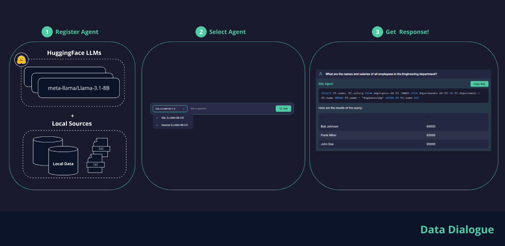
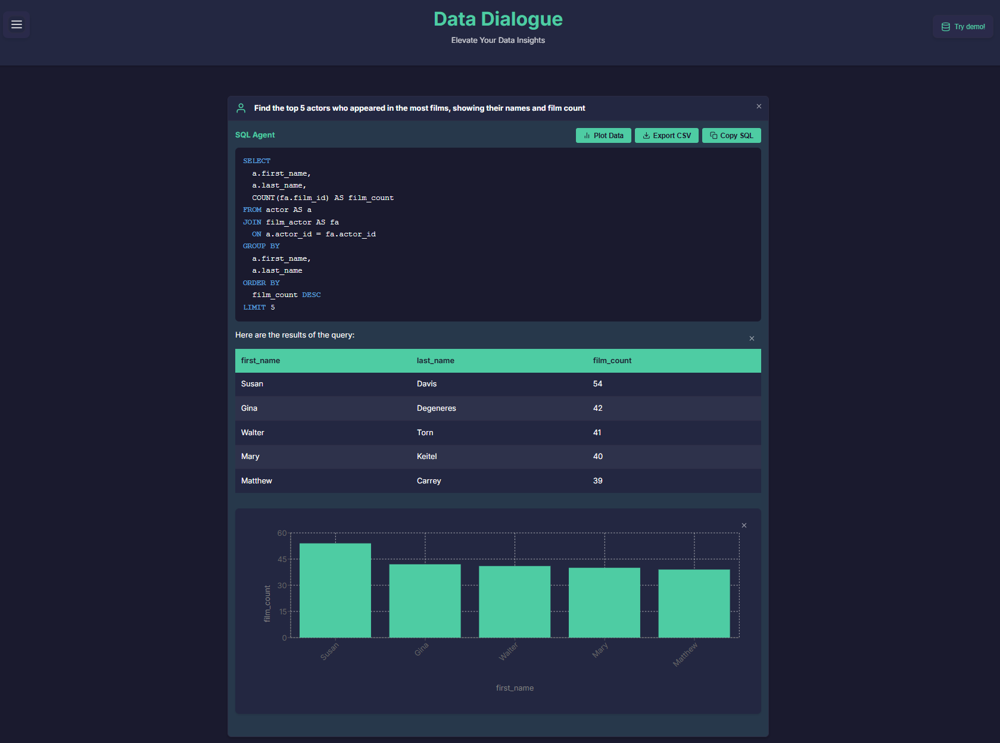
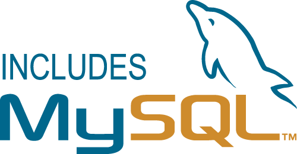

# Data Dialogue
## Elevate Your Data Insights

[](https://hub.docker.com/u/datadialogue)
[]()
[](https://github.com/ggeop/DataDialogueLLM/releases/latest)


[](https://github.com/ggeop/DataDialogueLLM/actions/workflows/release.yml)
[](https://github.com/ggeop/DataDialogueLLM/actions/workflows/black.yml)
[](https://pydantic.dev)
[](https://opensource.org/licenses/MIT)

---

## 🎉 Welcome to Data Dialogue

> Transform the way you interact with data using AI-powered conversations

DataDialogue is an innovative application that bridges the gap between your data and natural language understanding. By leveraging advanced AI capabilities, it enables intuitive data exploration and analysis through conversational interfaces.

A user can select a LLM model and connect it with a data source and do his analysis by writing simple prompts instead of writing SQL queries or code.




## ✨ Key Features

- **Natural Language Querying**: Interact with your data using simple prompts instead of SQL
- **Multiple LLM Integration**:
  - HuggingFace models
  - Commercial models (Google LLMs)
- **Flexible Architecture**: Extend to different data sources easily
- **RESTful API**: Easy integration with other systems
- **Secure Query Execution**: Protection against harmful SQL commands
- **Query Validation**: Create and validate queries with copy option
- **Results Visualization**: Interactive data visualization
- **Multiple Data Source Support**: Connect to various data sources

<table>
<tr>
<td valign="top">
<h3>Supported Providers</h3>
<table>
<tr><th></th><th>Provider</th><th align="center">Status</th></tr>
<tr><td></td><td>Google</td><td align="center">✔️</td></tr>
<tr><td></td><td>HF</td><td align="center">✔️</td></tr>
<tr><td></td><td>OpenAI</td><td align="center">✔️</td></tr>
<tr><td></td><td>Anthropic</td><td align="center">✔️</td></tr>
</table>
</td>
<td width="40"></td>
<td valign="top">
<h3>Supported Data Sources</h3>
<table>
<tr><th></th><th>Source</th><th align="center">Status</th></tr>
<tr><td></td><td>PostgreSQL</td><td align="center">✔️</td></tr>
<tr><td></td><td>MySQL</td><td align="center">✔️</td></tr>
<tr><td></td><td>Databricks</td><td align="center">✔️</td></tr>
<tr><td></td><td>Mongo DB</td><td align="center">✔️</td></tr>
<tr><td></td><td>CSV</td><td align="center">✔️</td></tr>
</table>
</td>
</tr>
</table>

## 🎯 Getting Started

### Prerequisites

- Docker
- Docker Compose

### Quick Installation

1. Clone the repository:
   ```sh
   git clone https://github.com/ggeop/data-dialogue.git
   cd data-dialogue
   ```

2. Run Data Dialogue services:
   ```sh
   docker-compose --env-file .env.prod up
   ```

3. Access the frontend at `http://localhost:5000` in your web browser.

> **Pro Tip**: Get your [FREE Google Gemini API key](https://aistudio.google.com/app/apikey) for the best cloud-based experience!

## 📚 Documentation

- [Installation Guide](getting-started/installation.md) - Detailed setup instructions
- [Quick Start Guide](getting-started/quick-start.md) - Get up and running quickly
- [Contributing](community/CONTRIBUTING.md) - How to contribute

## 🤝 Contributing

Your feedback and contributions make DataDialogue better! If you have:
- 💭 Feature suggestions
- 🐞 Bug reports
- 💡 General feedback

Please read our [Contributing Guidelines](community/CONTRIBUTING.md) before submitting any pull requests.

## ♥️ Support and Community

- Report issues via [GitHub Issues](https://github.com/ggeop/DataDialogueLLM/issues)
- Join our community discussions [here](https://github.com/ggeop/DataDialogueLLM/discussions)

## 📎 License

Distributed under the MIT License. See [License](license.md) for more information. 